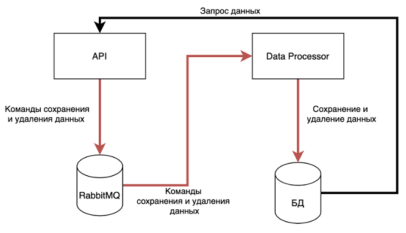

# 1. Movie
Необходимо: 
1. Реализовать код, читающий данные из файла и записывающий в таблицу через JDBC. Для добавления данных использовать PreparedStatement. В работе необходимо использовать следующий класс: 
```
class Movie { 
    private Integer year; 
    private Integer length; 
    private String title; 
    private String subject; 
    private String actors; 
    private String actress; 
    private String director; 
    private Integer popularity; 
    private Boolean awards; 
} 
``` 
    Данные, считываемые из файла должны быть упакованы в экземпляр указанного класса. Затем этот экземпляр должен передаваться коду, который будет отвечать за сохранение данных в БД Обратить внимание, что в файле могут некоторые значения могут отсутствовать. В таком случает надо вызывать preparedStatement.setNull(<index>, java.sql.Types.<тип>)
2. Для созданной таблицы написать запрос, выводящий количество фильмов каждого жанра (GROUP BY). Запрос написать в комментариях к коду решения

# 2. PersistentMap 
Необходимо реализовать Map,хранящий свое состояние исключительно в базе данных.То есть, любое изменение данных Map (добавление и удаление), а также получение данных должно транслироваться в соответствующие SQL запросы. Данные  необходимо хранить в таблице следующего вида:
```
 CREATE TABLE persistent_map( 
    map_name varchar, 
    KEY varchar, 
    value varchar ); 
```
- name-имя экземпляра Map
- key-ключ в экземпляре Map 
- value-значение, соответствующее ключу в текущем экземпляре Map 
 Реализация состоит в реализации следующего интерфейса 
 ```
 public interface PersistentMap{ 
    void init(String name); 
    boolean containsKey(String key) throws SQLException;
    List<String> getKeys() throws SQLException; 
    String get(String key) throws SQLException; 
    void remove(String key) throws SQLException; 
    void put(String key, String value) throws SQLException; 
    void clear() throws SQLException; 
}
```
- init. Метод используется для инициализации нового экземпляра Map. Принимает имя текущего экземпляра. Данные всех экземпляров хранятся в одной таблице, и имя используется для того, чтобы отделять данные одного экземпляра от данных другого 
- containsKey. Возвращает true тогда и только тогда, когда существует значение, связанное с данным ключом, false- в противном случае 
- getKeys. Возвращает список ключей, для которых есть значения в БД 
- get. Возвращает значение, связанное с переданным ключом remove. Удаляет пару ключ/значение из Map 
- put. Служит для добавления новой пары ключ-значение. В своей работе сначала удаляет существую пару из Map (если она есть), а затем добавляет новую 
- clear. Удаляет все данные из текущего экземпляра Map 

Допущение: можно считать, что одновременно только одно приложение будет работать с конкретным экземпляром. То есть, соблюдение строгой транзакционности и реализация многопоточной работы не обязательны! Создание таблицы производится отдельно. То есть в код создание таблицы добавлять не нужно!

# 3. FileSort 
Реализовать интерфейс 
```
public interface FileSorter { 
    File sortFile(File dataFile) throws Exception; 
} 
```
Реализация интерфейса получает на вход файл, состоящий из чисел (long), разделенных переносом строки и возвращает файл, в котором эти числа отсортированы в порядке убывания. 
1. Можно считать, что максимальный размер файла- 1000000 чисел 
2. Сортировку необходимо реализовать средствами БД 
3. Работа с БД- средствами JDBC 
4. При вставке данных обязательно использовать batch-processing. Разобраться что это такое, для чего используется и как реализовать

# 4. Event Sourcing 
Написать 2 приложения, реализующие функционал асинхронной записи данных в БД. Приложение оперирует классом Person, содержащий данные о людях. 
```
class Person { 
    private Long id; 
    private String name; 
    private String lastName; 
    private String middleName; // Getters, Setters, Constructor 
} 
```
Задача состоит из написание двух приложения, одно из которых содержит реализацию интерфейса взаимодействия с системой, второе- для взаимодействия с БД 

Архитектура представлена ниже



### Приложение DataProcessor 
Принимает из RabbitMQ сообщения о добавлении/удалении данных, затем выполняет в БДсоответствующие запросы. Необходимо, чтобы сообщения, отправленные первыми, обрабатывались также первыми (чтобы принцип FIFO не нарушался).
### Приложение API 
Приложение содержит реализацию следующего интерфейса: 
```
public interface PersonApi { 
    void deletePerson(Long personId); 
    void savePerson(Long personId, 
    String firstName, String lastName, 
    String middleName); 
    Person findPerson(Long personId); 
    List<Person> findAll(); 
} 
```
1. deletePerson генерирует сообщение-команду на удаление персоны с заданным id. Далее это сообщение должно быть обработано соответствующим запросом, выполняя удаление данных. Если данных для определенного personId не найдено- выводить в лог сообщение, что была попытка удаления, но при этом данные не найдены. Exception или другую ошибку не выдавать 
2. savePerson генерирует сообщение-команду на сохранение данных персоны. Обработчик должен проверить, существует ли в БД персона с переданным personId. Если существует- необходимо выполнить обновление данных (обновить три поля firstName, lastName, middleName). Если не существуетсоздать персону с переданным personId. 
3. findPerson. Генерирует запрос напрямую в БД и возвращает данные персоны, если персона для данного personId найдена, null в противном случае 
4. findAll. Генерирует запрос напрямую в БД и возвращает данные о ВСЕХ сохраненных в базе персонах 

Замечания по реализации 
1. Формат сообщений для сохранения и удаления данных разработать самостоятельно 
2. Приложения можно разрабатывать в одном пакете, просто с двумя классами, в которых есть метод main(String[].. args). Тогда запуск каждого приложениязапуск соответствующего класса: io.ylab.intensive.lesson04.eventsourcing.api.ApiApp и io.ylab.intensive.lesson04.eventsourcing.db.DbApp 
3. Вслучае возникновения ошибок и исключений- писать данные об этом в консоль 
4. Контролировать случай, что запрос данных возможен только после обработки всех сообщений не надо никак! Методы поиска должны возвращать то, что есть в БДнатекущий момент 
5. Реализация остается на усмотрение студентов, проверка будет заключаться в проверке реализации интерфейса PersonApi.